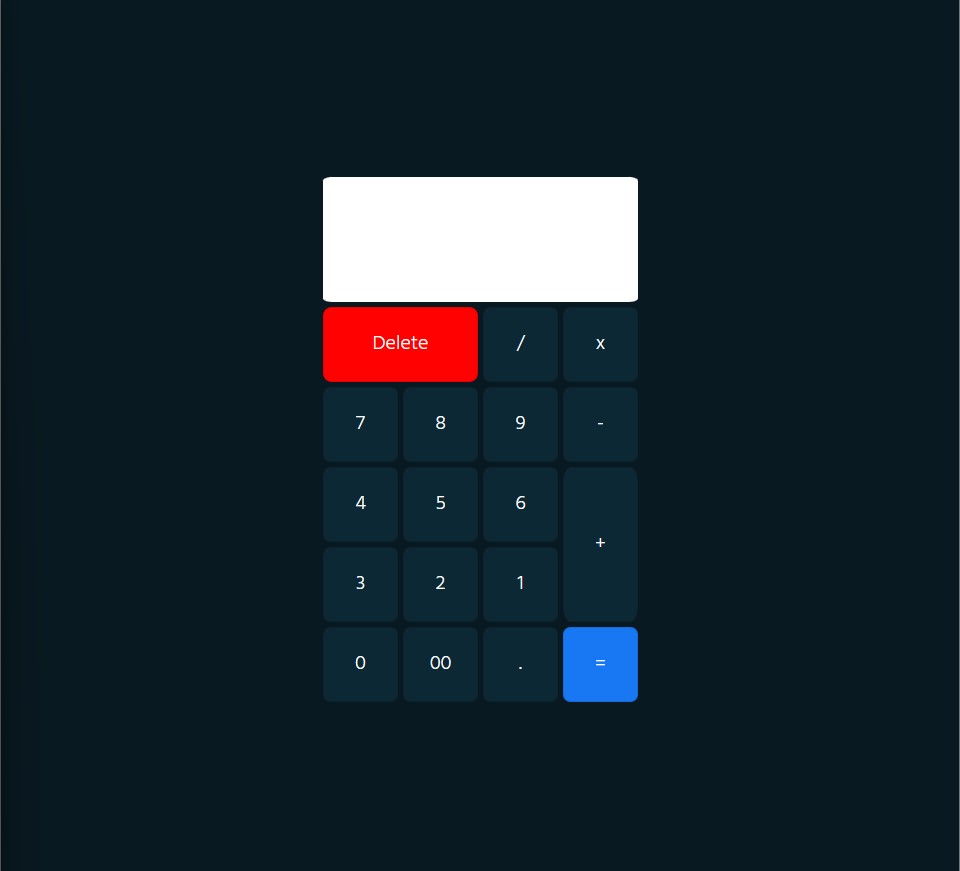

# Simple calculator🧮👽

---

## simple calculator using  the htlm css and javascript

[Demo](https://achchaimae.github.io/Simple-calculator-HTML-CSS-JS-/)

    

 

[- 📫 How to reach me **Achchaima1@gmail.com**]()

[- 📫  **Linkedin achchaimae khalaf**](https://www.linkedin.com/in/achchaimae-khalaf-335a86233/)